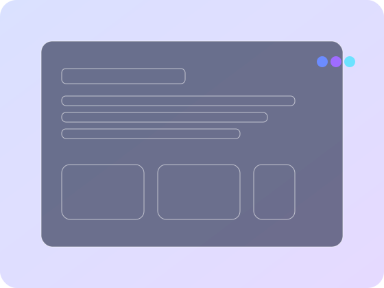

Aqui está um **README.md** profissional (pronto para copiar e colar no seu arquivo `readme.md`):

````md
# UX School — Landing Page (UI/UX)

Landing page moderna e acessível para cursos de **UI e UX Design**, focada em **hierarquia visual**, **contraste**, **microinterações** e **conversão**.

Desenvolvida com **HTML5 + CSS3 + JavaScript** (sem frameworks), com código **semântico**, **responsivo** e **otimizado para performance**.



---

## 📚 Sumário

- [✨ Destaques](#-destaques)
- [🔧 Stack](#-stack)
- [🗂 Estrutura de Pastas](#-estrutura-de-pastas)
- [🚀 Executando Localmente](#-executando-localmente)
- [🌐 Deploy](#-deploy)
- [🧭 Navegação & Seções](#-navegação--seções)
- [♿ Acessibilidade (A11y)](#-acessibilidade-a11y)
- [🎨 Personalização Rápida](#-personalização-rápida)
- [📈 Performance & SEO](#-performance--seo)
- [🧪 Testes manuais sugeridos](#-testes-manuais-sugeridos)
- [🧱 Convenções do Projeto](#-convenções-do-projeto)
- [🗺 Roadmap](#-roadmap)
- [🤝 Contribuindo](#-contribuindo)
- [📄 Licença](#-licença)
- [👤 Autor](#-autor)
- [📎 Notas](#-notas)
- [⌨️ Comandos úteis](#️-comandos-úteis)

---

## ✨ Destaques

- **Design clean e responsivo** (grid fluida, tipografia com `clamp()`).
- **Acessibilidade real**: skip link, foco visível, landmarks semânticos, ARIA auxiliar, validação não intrusiva.
- **Conversão**: CTA primário no hero, prova social (depoimentos), FAQ para reduzir objeções, CTA final.
- **Microinterações**: header com elevação no scroll, menu mobile com `aria-expanded`, scroll suave, carrossel simples.
- **Código escalável**: componentes semânticos, variáveis CSS, tokens de espaçamento, separação de responsabilidades.
- **Zero dependências**: HTML/CSS/JS puros (ideal para ensino e demonstrações).

---

## 🔧 Stack

- **HTML5** semântico
- **CSS3 / Modern CSS**: variáveis, `color-mix`, `clamp`, grid/flex
- **JavaScript** Vanilla (ES2020+) com `defer`
- **SVG** otimizado para ícones/ilustrações

---

## 🗂 Estrutura de Pastas

```txt
/
├─ index.html
├─ css/
│  └─ style.css
├─ js/
│  └─ script.js
└─ assets/
   └─ img/
      ├─ logo.svg
      ├─ favicon.svg
      └─ hero-illustration.svg
````

---

## 🚀 Executando Localmente

### Opção 1 — Abrir diretamente

Abra `index.html` no navegador (duplo clique).

> Dica: servir localmente evita problemas comuns de carregamento de assets e simula melhor o ambiente real.

---

## 🌐 Deploy

### GitHub Pages

1. Acesse **Settings → Pages**
2. Em **Build and deployment** selecione: **Deploy from a branch**
3. Branch: `main`
4. Pasta: `/ (root)`

### Vercel / Netlify

* Importe o repositório e use a configuração padrão de **projeto estático** (Static Site).
* Não é necessário build step.

---

## 🧭 Navegação & Seções

* **Header:** logo + navegação principal + CTA “Começar agora”
* **Hero:** título forte, subtítulo, formulário de e-mail (validação gentil), destaques
* **Benefícios:** clareza, acessibilidade e conversão (3 cards)
* **Conteúdo (timeline):** UX → UI/Design System → Prototipação/Testes
* **Depoimentos (carrossel):** 3 depoimentos com controles prev/next
* **CTA final:** reforço da ação (download/começar agora)
* **FAQ:** perguntas frequentes com `<details>`

---

## ♿ Acessibilidade (A11y)

* **Skip link** para pular direto ao conteúdo principal.
* **Semântica:** `header`, `main`, `section`, `nav`, `footer`, `figure`, `blockquote`.
* **Navegação por teclado:** foco visível e ordem lógica (`:focus-visible`).
* **ARIA:** `aria-label`, `aria-live` (formulário), `aria-roledescription` (carrossel).
* **Formulário:** `label` atrelado ao `input` (`for/id`), `required`, `inputmode`, feedback não intrusivo.

---

## 🎨 Personalização Rápida

Edite variáveis em `:root` (no arquivo `css/style.css`):

```css
:root{
  --bg: #0b1020;
  --surface: #0f1530;
  --text: #e7ecff;
  --muted: #a9b4d0;

  --primary: #6c8cff;     /* Cor principal */
  --primary-700: #4f6df0; /* Hover/ativo */

  --radius: 16px;         /* Raio padrão de bordas */
}
```

Troque a marca em:

* `assets/img/logo.svg`
* Texto “UX School” (no header)
* `<title>` e `meta description` (SEO)

---

## 📈 Performance & SEO

* Sem JS pesado e imagens **SVG otimizadas**.
* `defer` no script para não bloquear renderização.
* Meta description e headings semânticos.
* Responsividade e contraste com foco em **AA**.

> Para produção, avalie: minificar CSS/JS, preload de fontes e headers de cache no servidor.

---

## 🧪 Testes manuais sugeridos

* Navegação por teclado (Tab/Shift+Tab).
* Foco visível em links/botões/itens de menu.
* Leitores de tela (NVDA/VoiceOver): ordem e rótulos.
* Mobile (≤ 760px): menu hambúrguer e layout fluido.
* Formulário: validação com e sem e-mail válido.
* Carrossel: botões prev/next alternando depoimentos.

---

## 🧱 Convenções do Projeto

* **HTML:** semântico, estrutura clara, landmarks bem definidos.
* **CSS:** variáveis, tokens de espaçamento, componentes simples, media queries para responsividade.
* **JS:** progressivo, sem dependências, cuidando de `aria-expanded` e `aria-live`.
* **Nomenclatura de classes:** BEM-like (ex.: `.hero__title`, `.section__title`).

---

## 🗺 Roadmap

* [ ] Botão “Voltar ao topo”.
* [ ] Analytics com consentimento (LGPD).
* [ ] Testes e2e (Playwright/Cypress) para navegação/CTA.
* [ ] Otimização de fontes (preload + fallbacks).
* [ ] Toggle Dark/Light usando `prefers-color-scheme`.
* [ ] Versão temática para SaaS de agendamento (manicure/pedicure).

---

## 🤝 Contribuindo

1. Faça um fork do projeto.
2. Crie uma branch:

   ```bash
   git checkout -b feature/nome-da-feature
   ```
3. Commit:

   ```bash
   git commit -m "feat: descrição clara"
   ```
4. Push:

   ```bash
   git push origin feature/nome-da-feature
   ```
5. Abra um Pull Request.

**Padrão de commits:** `feat:`, `fix:`, `docs:`, `style:`, `refactor:`, `test:`, `chore:`.

---

## 📄 Licença

Este projeto é disponibilizado sob a licença **MIT**.
Sinta-se à vontade para usar em salas de aula, portfólios e demonstrações.

---

## 👤 Autor

**Jailson Costa dos Santos**
Landing page voltada para ensino de UI/UX com HTML/CSS/JS limpos e acessíveis.

---

## 📎 Notas

Repositório ideal para aulas e workshops, mostrando boas práticas com complexidade controlada: base sólida para evoluir para Design System, tokens, componentização e testes.

---
```
